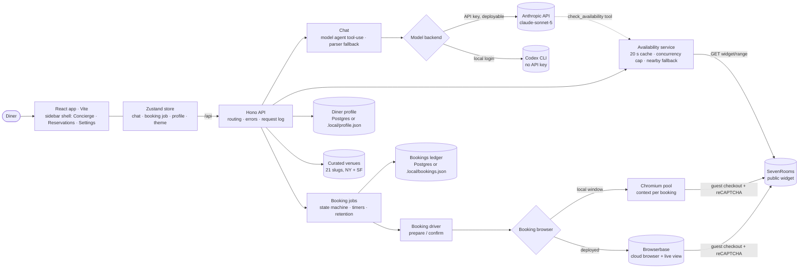
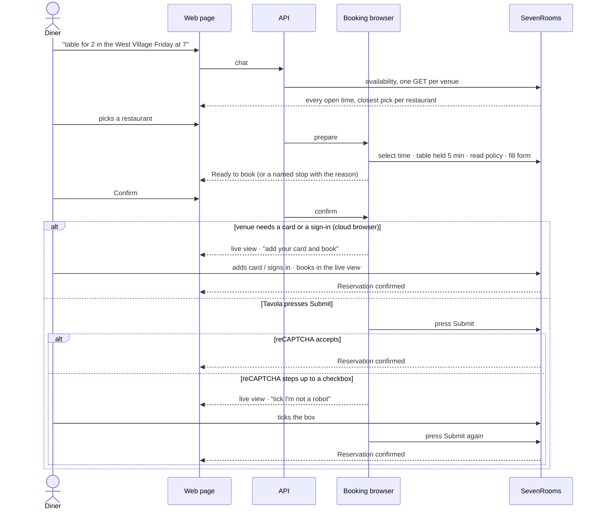
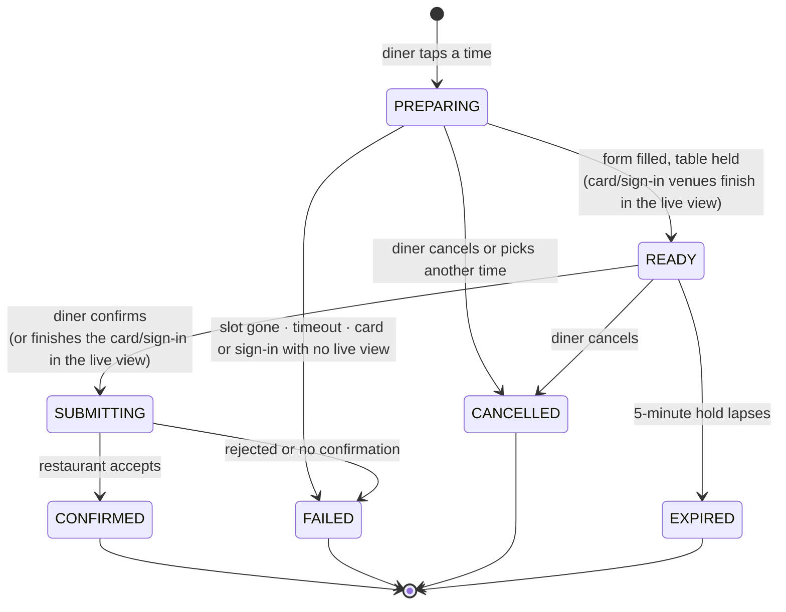
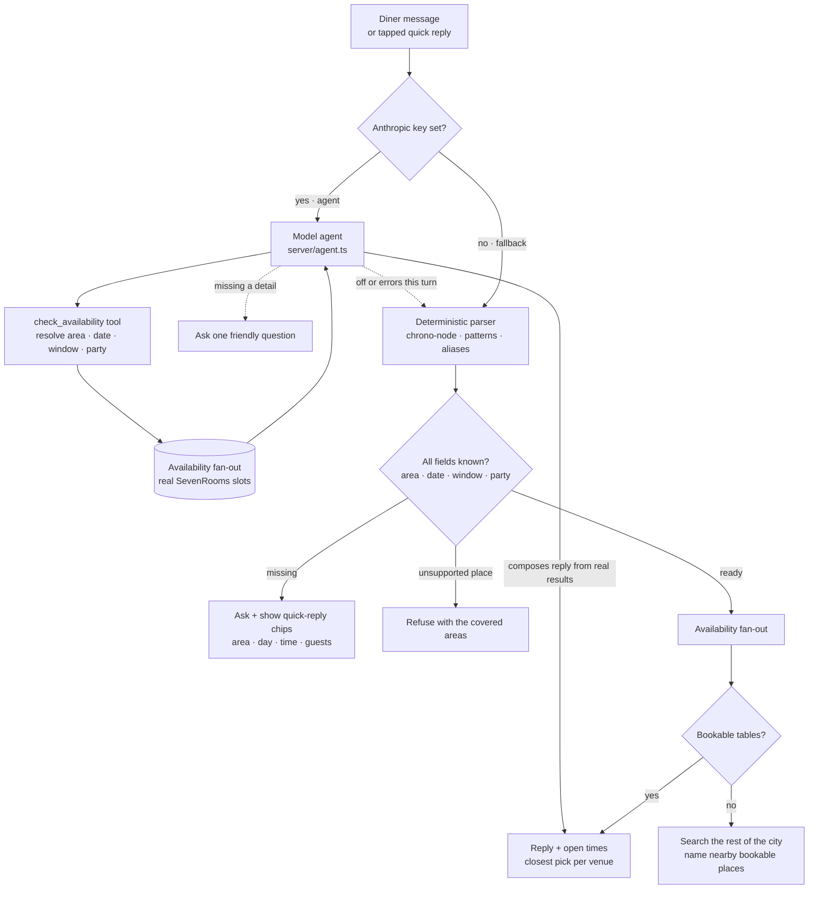
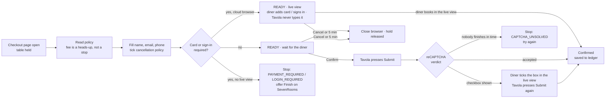
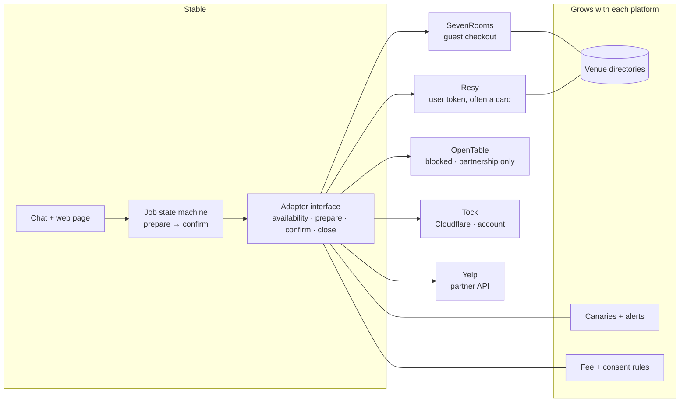
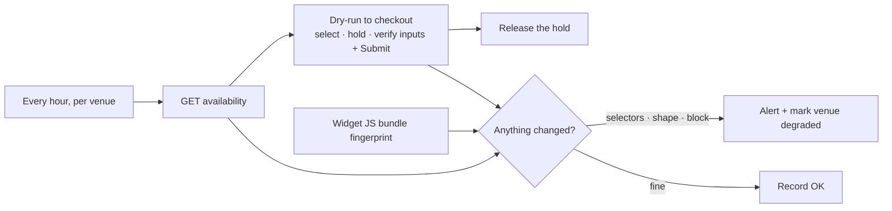

# Tavola demo — architecture diagrams

All diagrams are Mermaid and render on GitHub. The same sources are rendered to images for the presentation.

The frontend is a Vite + React sidebar shell (Concierge, Reservations, Settings) with a typed Zustand store holding chat, the booking job and its polling, the profile, saved bookings and the theme; UI is split into `web/ui` primitives and `web/features/*`. Motion is Framer Motion.

## 1. System overview

## 2. One booking, end to end

## 3. Booking job states

## 4. Understanding a message

With an Anthropic key the model is the agent: it resolves the request and calls a `check_availability` tool over the real widget data, then writes the reply from what came back (`server/agent.ts`). The deterministic parser is the always-on fallback — used when no key is set and if the agent errors on a turn.

## 5. Guardrails at the checkout

## 6. From one platform to five

## 7. Knowing before a diner does (V2 canary)

