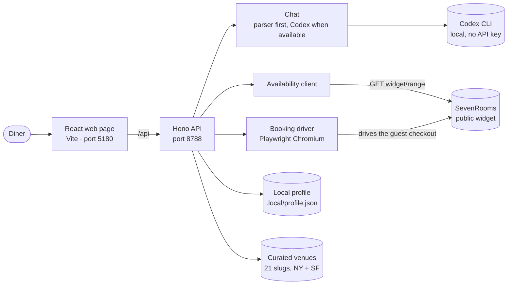
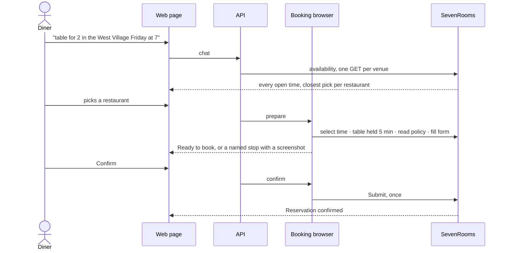
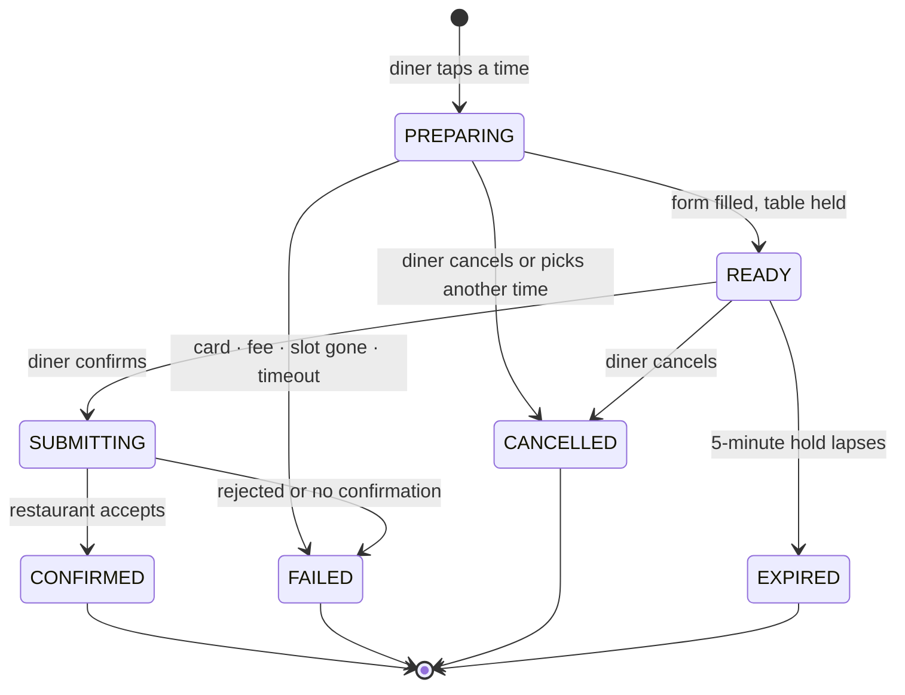
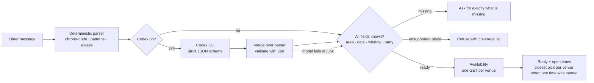
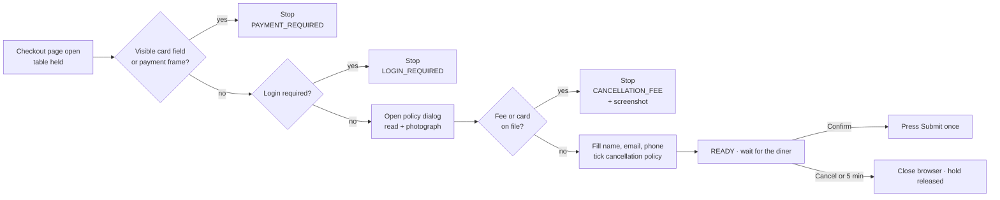
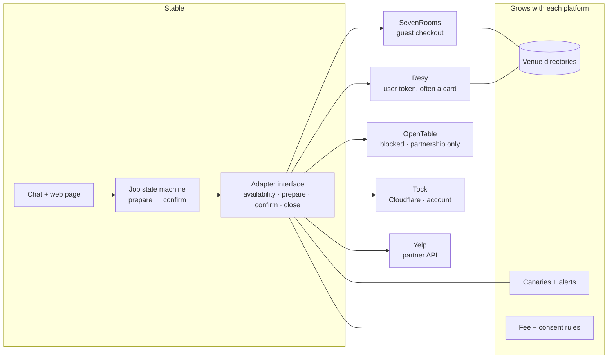
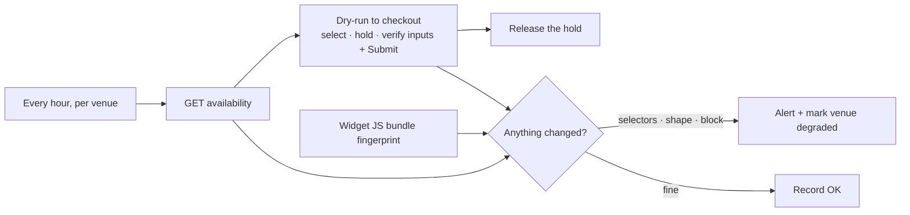

# Pearl demo — architecture diagrams

All diagrams are Mermaid and render on GitHub. The same sources are rendered to images for the presentation.

## 1. System overview

## 2. One booking, end to end

## 3. Booking job states

## 4. Understanding a message

## 5. Guardrails at the checkout

## 6. From one platform to five

## 7. Knowing before a diner does (V2 canary)

